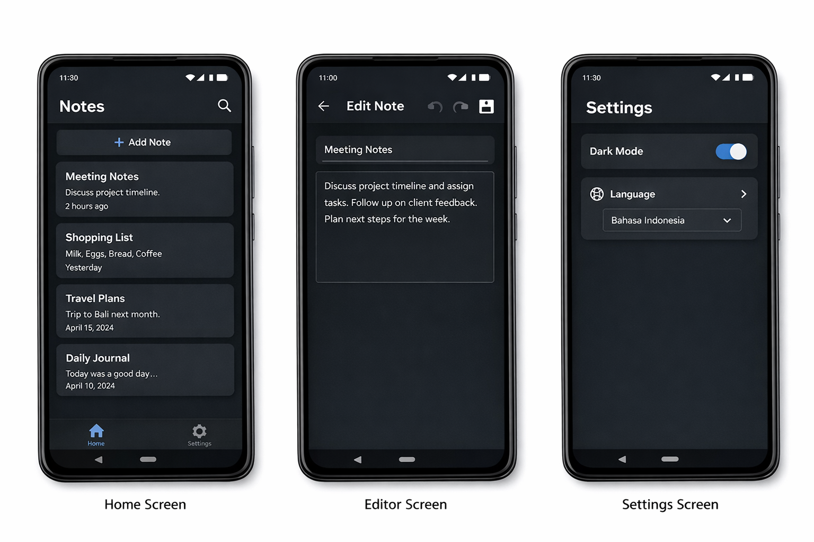

# 📒 Android Notes App (Flutter)

A modern **Android Notes application** built with **Flutter** using **Material 3**, inspired by **Notion** and **Google Keep**.

This app supports basic text notes with **add, edit, delete, undo/redo**, **default dark mode**, and **multi-language support** (Indonesian & English). All notes are stored locally using **Hive**, ensuring **data persistence** even when the app is closed or offline.

---

## ✨ Key Features

* ➕ **Add new notes**
* ✏️ **Edit existing notes**
* 🗑️ **Delete notes** (long press)
* ↩️ **Undo & Redo text** (Android-only, via buttons)
* 🌙 **Dark Mode** (enabled by default)
* 🌐 **Multi-Language** (Indonesian & English)
* 💾 **Local storage** using Hive
* 🎨 **Modern Material 3 UI**
* 🗂️ **Clean & scalable project structure**

---

## 🖼️ Demo / Screenshots

**Home Screen & Editor**

(Optional: add more screenshots)




---

## 🛠️ Technologies Used

| Technology            | Description            |
| --------------------- | ---------------------- |
| Flutter               | UI Framework           |
| Dart                  | Programming Language   |
| Provider              | State Management       |
| Hive                  | Local Database         |
| Material 3            | UI Design              |
| UUID                  | Generate Note IDs      |
| flutter_localizations | Multi-Language Support |

---

## 🗂️ Project Structure

```
lib/
├── main.dart
├── models/
│   ├── note.dart
│   └── note.g.dart
├── providers/
│   ├── note_provider.dart
│   ├── theme_provider.dart
│   └── locale_provider.dart
├── screens/
│   ├── home_screen.dart
│   ├── editor_screen.dart
│   └── settings_screen.dart
├── widgets/
│   ├── note_card.dart
│   └── undo_redo_bar.dart
└── utils/
    └── app_strings.dart
```

---

## 🌙 Dark Mode

* Enabled by default
* Can be toggled in Settings
* Uses Material 3 theme

---

## 🌐 Multi-Language

Available languages:

* 🇮🇩 Indonesian (default)
* 🇬🇧 English

Language can be changed **in real-time** via Settings.

---

## ↩️ Undo & Redo

* Undo / Redo based on text snapshots
* Focused on **Android** (no keyboard shortcuts)
* Dedicated buttons in the editor
* Safe when editing old notes

---

## 💾 Data Persistence

* Powered by **Hive**
* Data stored **locally**
* Works **offline**
* Notes remain after closing the app

---

## 🚀 How to Run

```bash
flutter pub get
flutter pub run build_runner build
flutter run
```

---

## 📦 Main Dependencies

* provider
* hive
* hive_flutter
* uuid
* flutter_localizations

---

## 📌 App Status

* ✅ Core features implemented
* ✅ Stable for basic usage
* ✅ Ready for further development

---

## 🔮 Future Enhancements (Optional)

* 🔍 Search & filter notes
* 📌 Pin notes
* ☑️ Checklist / Markdown support
* 💾 Autosave
* ☁️ Backup & restore
* 🎞️ Animations like Notion
* 📄 Export notes to PDF / TXT
